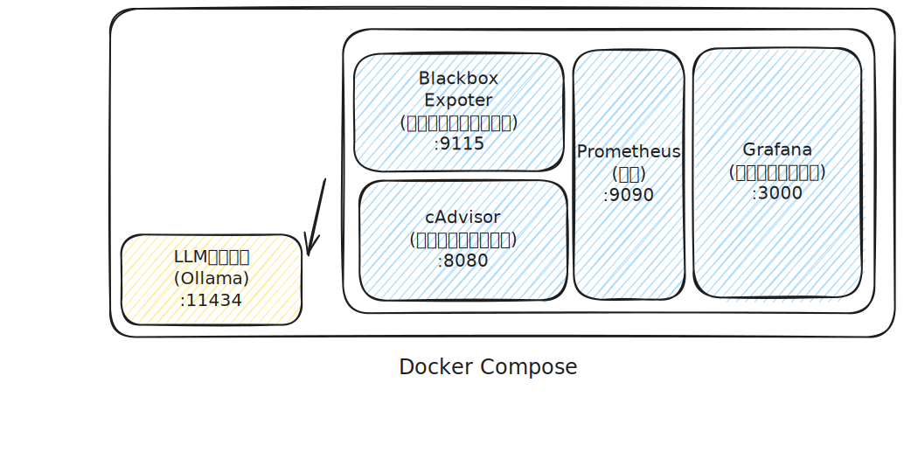

# インフラ構成

## 概要

Hazumuプロジェクトの推論バックエンド環境は、以下のコンポーネントで構成されています：

## コンポーネント

### Ollama (LLM推論サーバー)

- **役割**: 大規模言語モデル(LLM)の推論を実行
- **ポート**: 11434
- **データ永続化**: `ollama_data` ボリューム

Ollamaは軽量で高速なLLM推論エンジンです。様々なオープンソースモデル（Llama, Mistral, Gemmaなど）をサポートしています。

### Prometheus (メトリクス収集)

- **役割**: 各サービスからメトリクスを収集・保存
- **ポート**: 9090
- **データ永続化**: `prometheus_data` ボリューム
- **保持期間**: 15日

以下のジョブを監視：
- Prometheus自身
- Ollamaコンテナ (cAdvisor経由でCPU/メモリ/ネットワーク)
- cAdvisor (コンテナリソース)
- Blackbox Exporter
- Ollamaヘルスチェック (HTTP応答確認)

**注**: Ollamaは標準でPrometheusメトリクスエンドポイントを提供していないため、コンテナレベルのメトリクスはcAdvisor経由で収集します。

### Grafana (可視化)

- **役割**: メトリクスの可視化とダッシュボード提供
- **ポート**: 3000
- **デフォルト認証**: admin / admin
- **データ永続化**: `grafana_data` ボリューム

自動的に以下が設定されます：
- Prometheusデータソース
- Ollamaモニタリングダッシュボード

### cAdvisor (コンテナリソース監視)

- **役割**: Dockerコンテナのリソース使用状況を収集
- **ポート**: 8080

CPU、メモリ、ネットワーク、ディスクI/Oなどの詳細なメトリクスを提供します。

### Blackbox Exporter (エンドポイント監視)

- **役割**: HTTPエンドポイントのヘルスチェックと応答時間測定
- **ポート**: 9115

Ollamaの`/`エンドポイントに対して定期的にHTTPリクエストを送信し、可用性と応答時間を監視します。

## ネットワーク

すべてのサービスは`hazumu-network`という名前のブリッジネットワークで接続されています。これにより、各コンテナは名前解決で相互に通信できます。

## データ永続化

以下のDockerボリュームでデータを永続化しています：

- `ollama_data`: ダウンロードしたモデルとOllama設定
- `prometheus_data`: メトリクスの時系列データ
- `grafana_data`: ダッシュボード設定とユーザーデータ

## セキュリティ考慮事項

### 現在の設定（開発環境向け）

- Grafanaのデフォルトパスワードは`admin`（開発環境用）
- すべてのサービスが外部にポート公開されている
- cAdvisorは`privileged`モードで実行（コンテナメトリクス収集に必要）

⚠️ **警告**: この設定は開発・テスト環境向けです。本番環境では適切なセキュリティ対策を実施してください。

### 本番環境での推奨事項

1. **認証情報の保護**
   - Grafanaの認証情報を環境変数またはDocker secretsから読み込む
   - パスワードポリシーの強化
   
2. **ネットワークセキュリティ**
   - 必要なポートのみを公開（例：Grafanaの3000のみ）
   - Nginxなどのリバースプロキシを追加
   - TLS/SSL証明書の設定
   - ファイアウォールルールの設定
   
3. **アクセス制御**
   - VPNやSSHトンネル経由でのアクセスに制限
   - IPアドレスベースのアクセス制限
   - Grafanaの組織・チーム機能を使用した権限管理
   
4. **監査とモニタリング**
   - アクセスログの記録と監視
   - 異常なアクセスパターンの検出
   
5. **コンテナセキュリティ**
   - cAdvisorのポート（8080）を内部ネットワークのみに制限
   - 定期的なイメージの更新とセキュリティパッチ適用
   - 不要な権限の最小化

## 拡張性

この構成は以下のような拡張が容易です：

- **複数のOllamaインスタンス**: ロードバランシングの追加
- **Alertmanager**: アラート通知の追加
- **Loki**: ログ集約の追加
- **追加のExporter**: Node Exporter（ホストメトリクス）など
- **カスタムダッシュボード**: Grafanaで独自のダッシュボード作成
