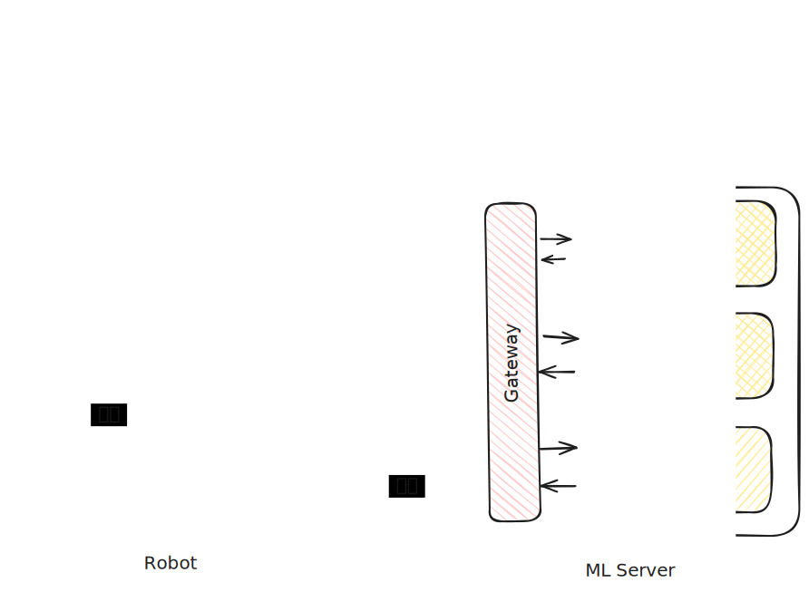

# はずむAI概要

## 目的

愛玩ロボット「はずむAIくん」が、音声・映像入力を通じて人間と自然にインタラクションできるようにする。

## 構成

### ロボット側（Raspberry Pi）

- カメラ、マイク、モーター制御
- [MCP](https://modelcontextprotocol.io/docs/getting-started/intro) Serverによる制御インターフェース

### 推論サーバー

- WebSocket通信でロボットと接続
- 感情分析や行動決定などの推論処理を担当

## リポジトリ構成

Monorepo構成で開発を行う。

- `apps/**`: 各コンポーネント
  - `apps/robot-daemon/`: ロボット常駐プロセス
  - `apps/robot-mcp/`: ロボット制御のMCP Server
  - `apps/ml-gateway/`: モデルとRobot MCPを仲介
  - `apps/ml-server`: 推論スタック
- `docs/`: 開発用ドキュメント
